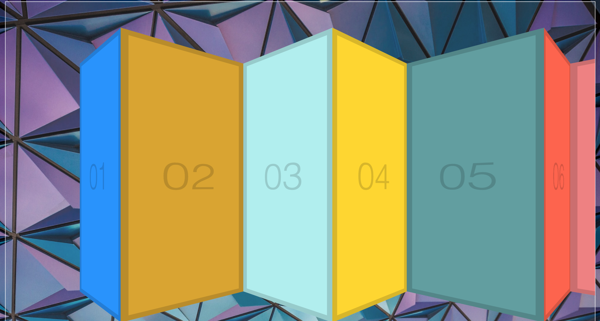

# Click and Drag

Day 27 of Javascript30 by WesBos. Made a site which has a cool click and drag feature. It was a great project to practice mouse related events, page / offset / scroll coordinates.

# Demo

# Technologies Used

HTML5, CSS, Vanilla JS

# Website

https://buigabor.github.io/stripe-follow/
